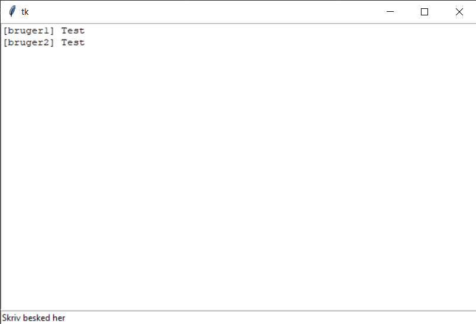

# chatapp
Jeg laver et chatprogram som gør det muligt at skrive med personer over det lokale netværk. Måden det kommer til at fungere på er at der er en server og en klient. Serveren kommer til at håndtere alle forbindelser og får så beskederne sendt ud til klienterne. Jeg laver en database som indeholder alle users, med brugernavn og password(hashede) Tænker jeg at jeg laver en database med brugere som er ”banned” som også indeholder, hvornår hvorfor og hvor lang tid. De 2 databaser kommer så til at blive forbundet med userID. Der kommer til at være 2 slags brugere almindelig user og admin som så kan gøre forskellige ting f.eks. at admins kan fjerne brugere, timeout mm.
Jeg har lavet en lille demo for at vise hvordan jeg tænker det kommer til at se ud.

